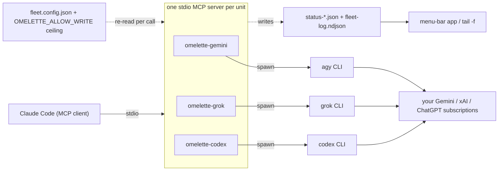

<p align="center">
  
</p>

<h1 align="center">Omelette Fleet</h1>

<p align="center">Gemini, Grok and Codex as read-only units in Claude Code</p>

<p align="center">
  <a href="https://github.com/adxd-og/omelette-fleet/actions/workflows/test.yml"></a>
  <a href="LICENSE"></a>
  
  
</p>

## What you get

Three peers inside Claude Code, each on a subscription you already pay for, none of them able to write. `doctor` is where you find out whether that is actually true on your machine:

```console
$ omelette-fleet doctor      # example output — all three units; config tables trimmed
FLEET DOCTOR · omelette-fleet 0.3.5 · node v20.19.5 · darwin
version       0.3.5 · latest 0.3.5
fleet home    ~/.omelette
fleet config  ~/.omelette/fleet.config.json
claude CLI    ~/.local/bin/claude
claude config ~/.claude.json
rules         project: v0.3.5 · global: absent
agents        project: v0.3.5 (2) · global: absent
skills        project: v0.3.5 (1) · global: absent
hooks         project: v0.3.5 (wired: PreToolUse, PreCompact, SessionStart, PostToolUse, Stop) · global: absent
handoff       nudge at 90% of 200000 (default) · Stop gate on · ledgers: 1
mcp timeout   wall-clock: MCP_TOOL_TIMEOUT unset (default ~28 h) ≥ 1800000 needed · ok
              deep research: gemini_deep_research worst case: 3 stages × 2 attempts × (300 + 60 s) = 2160 s · within the wall-clock limit
              idle: CLAUDE_CODE_MCP_TOOL_IDLE_TIMEOUT unset → 30 min default; grok.timeoutS=1800 s reaches it — units send progress every 30 s when the client passes a progress token; otherwise set CLAUDE_CODE_MCP_TOOL_IDLE_TIMEOUT=0 or a per-server "timeout"

── gemini (Gemini) ────────────────────────────────────────────
  bin         agy → ~/.local/bin/agy   [AGY_BIN=(unset)]
  version     1.1.25
  login       OK — agy models listed 14 line(s)
  config      closed — OMELETTE_ALLOW_WRITE does not list "gemini" · effective mode: read-only
              KEY        VALUE                    SOURCE
              enabled    true                     file
              mode       read-only                file
              model      Gemini 3.8 Flash (High)  file
              timeoutS   300                      file
  mcp         omelette-gemini registered (user) → node ~/omelette-fleet/servers/gemini.mjs [file exists]
  status feed ~/.omelette is writable
  results     ~/.omelette/results/gemini · keep 50 · max 50 MB

── grok (Grok) ────────────────────────────────────────────────
  bin         grok → ~/.grok/bin/grok   [GROK_BIN=(unset)]
  version     grok 1.0.13 (5e9a58528b76) [stable]
  login       OK — grok models listed 5 line(s)
  config      closed — OMELETTE_ALLOW_WRITE does not list "grok" · and this unit refuses workspace-write anyway · effective mode: read-only
  mcp         omelette-grok registered (user) → node ~/omelette-fleet/servers/grok.mjs [file exists]

── codex (Codex) ──────────────────────────────────────────────
  bin         codex → ~/.local/bin/codex   [CODEX_BIN=(unset)]
  version     codex-cli 0.153.0
  login       OK — Logged in using ChatGPT
  config      closed — OMELETTE_ALLOW_WRITE does not list "codex" · effective mode: read-only
  mcp         omelette-codex registered (user) → node ~/omelette-fleet/servers/codex.mjs [file exists]

No faults in units that are both enabled and registered.
```

## How it fits together



Plug Google Gemini, xAI Grok and OpenAI Codex into Claude Code as MCP **units** — read-only research and code-review peers. Each unit is its own stdio MCP server that spawns the vendor's own CLI headless (`agy`, `grok`, `codex`), so every call rides the subscription you already pay for. The child environment is built from a small allowlist rather than inherited, and API keys that would silently switch a CLI to metered billing are scrubbed on top of it. Claude Code stays the manager: **units propose, the manager applies.** A single config file with a two-key write ceiling keeps a unit from becoming a foot-gun, and a status feed reports what each unit is doing right now.

Zero runtime dependencies. Node core only, no build step.

## Requirements

- **Node ≥ 20**
- **Claude Code** (the MCP client that will host the units)
- **Any subset** of the vendor CLIs, installed and logged in: `agy` (Antigravity, for Gemini), `grok` (Grok Build), `codex` (Codex CLI).
- **macOS or Linux.** Windows works through WSL; native Windows is not supported yet — CI runs the suite on `windows-latest` as a signal only, and 43 tests fail there today (POSIX path assertions, fake binaries without `.cmd` shims, file modes). Tracked for a later release.

A partial fleet is normal and expected. `install` skips units whose CLI is not on `PATH`; the units you do have work exactly the same.

## Quickstart

Install the units once, from the clone:

```bash
git clone https://github.com/adxd-og/omelette-fleet.git
cd omelette-fleet
./bin/omelette-fleet.mjs install
```

Then give one project the operating rules — **from inside that project**, because every file this writes lands in the current directory:

```bash
cd /path/to/your/project
/path/to/omelette-fleet/bin/omelette-fleet.mjs rules --agents --hooks
```

(`install --rules` does both halves in one run, and its second half targets the current directory too — so run *that* from the project, not from the clone.)

Then: **restart Claude Code**, **merge the printed snippet** into that same project's `.claude/settings.json`, and run **`omelette-fleet doctor`** there — it names the one thing still missing, if there is one.

`install` registers one MCP server per available unit with `claude mcp add -s user`, named `<prefix>-<unit>` (default prefix `omelette`, so `omelette-gemini`, `omelette-grok`, `omelette-codex`), and creates `~/.omelette/fleet.config.json` from `examples/fleet.config.json` if you don't have one. The tools appear after the restart as `mcp__<prefix>-<unit>__<tool>` — for example `mcp__omelette-codex__codex_code_review`.

`--rules` adds the second half in the current directory: it is exactly `rules --agents --hooks`, so you get the operating rules, both sub-agent definitions, the `/omelette-test` skill, the guard script and the settings snippet to paste. `install --rules --dry-run` prints both halves and changes nothing. Leave it off and the same files are one command away:

```bash
./bin/omelette-fleet.mjs rules          # <project>/.claude/rules/omelette-fleet.md
./bin/omelette-fleet.mjs rules --global # ~/.claude/rules instead
./bin/omelette-fleet.mjs rules --agents # + the coder / tester sub-agent definitions and the /omelette-test skill
```

Rules load on the next session start; agent definitions and skills are picked up by Claude Code's watcher — usually within seconds, sometimes minutes (restart if `.claude/agents` or `.claude/skills` did not exist before).

Optionally, install the guard hook — the coder's and the tester's "never commits" rule, enforced rather than requested, plus a ledger marker on every compaction, the last handoff block printed back into the session that follows one, and — past 90 % of the context window — a reminder to write that block and one held `Stop` until it exists:

```bash
./bin/omelette-fleet.mjs rules --hooks  # writes .claude/hooks/omelette-guard.mjs
```

It prints a settings snippet and you merge it in yourself, into `.claude/settings.json` or `.claude/settings.local.json`: a hook script does nothing until your settings call it, and omelette-fleet reads those files but never writes them. The snippet is a whole `hooks` object, so — as the printed line says — *"Merge this into your settings file (it is a whole `hooks` object — add the events it lists to an existing `hooks` block rather than replacing the file)"*. The script path in it is quoted for the platform the CLI runs on: POSIX single quotes on macOS and Linux, double quotes on Windows, where the JSON layer then doubles the backslashes of the path (`"node \"C:\\Users\\me\\.claude\\hooks\\omelette-guard.mjs\""`). Double quotes are a shell quoting, not an argv: under PowerShell or Git Bash a `$` in that path would expand, so a path holding one wants editing by hand — one more reason native Windows is not supported yet. `doctor` reads both files and reports `hooks         project: v0.3.5 (wired: PreToolUse, PreCompact, SessionStart, PostToolUse, Stop)` — or `NOT wired`, which is the failure mode where everything looks installed; a `PreToolUse` entry whose matcher cannot see a `Bash` call is reported as `NOT wired (PreToolUse matcher is not Bash)`, since it will never see the call it exists to guard. A matcher is read the way Claude Code reads it: an **exact list or an unanchored regex**. A string of nothing but tool names, `|`, `,` and spaces is a list — `Bash|Edit` and `Bash, Write` are wired, `Bashful` and `ash` are not — and anything else is a regex tested against `Bash` unanchored, so `.*`, `Ba.` and `ash$` are wired too; an absent matcher, `""` and `"*"` mean every tool. One that does not compile counts as nothing and is named as what it is — `NOT wired (PreToolUse matcher "(" is not a valid regex)` — because that is a typo to fix, not a guard aimed at the wrong tool, and a matcher that is not a string at all is reported as `NOT wired (PreToolUse matcher is not a string)`. The `SessionStart` group is matched on the session's **source** rather than a tool: the snippet wires `"matcher": "compact"`, `startup` is reported as `NOT wired (SessionStart matcher is not compact)`, and a guard still wired the 0.3.2 way reads `NOT wired (missing SessionStart, PostToolUse, Stop)`. The `PostToolUse` and `Stop` groups carry no matcher: every tool call grows the context and every `Stop` is one. `doctor` adds a `handoff` line under the `hooks` one saying what the installed guard will do — `handoff       nudge at 90% of 200000 (default) · Stop gate on · ledgers: 1` — with the ceiling's source in parentheses and `ledgers: none (hook silent — start .omelette/ledger-<plan>.md)` when the project keeps no ledger, which is the state in which the auto-handoff deliberately does nothing.

Then check the install:

```bash
./bin/omelette-fleet.mjs doctor
```

`doctor` reports the binaries and versions it found, login state, the resolved config with sources, the effective mode and write ceiling per unit, MCP registration, and whether the status-feed directory is writable. Above the units it reports the managed files, and under the `hooks` line the `handoff` one — what the installed guard will do about the auto-handoff, read back out of the script itself: the threshold, the window it measures against and where that window came from, whether the `Stop` gate is on, and how many ledgers there are to guard. The window's source is one of five, in this order: `handoff.contextWindow` → `CLAUDE_CODE_AUTO_COMPACT_WINDOW` → `autoCompactWindow` → `model[1m]` → `default`. It reads Claude Code's `.claude.json` from `$CLAUDE_CONFIG_DIR` first and `~/` second, and prints which file it used — "not registered" against the wrong file would be a lie. It reads the project's `.mcp.json` too, and names it when it is there.

A registration counts as ours by **where it points**, not by what it is called: command `node`, args path exactly this clone's `servers/<unit>.mjs`. So if you registered the units under your own prefix, `doctor` finds them, says `prefix        orion (found on the registrations)` and reports the rest under that name instead of announcing that `omelette-*` is missing. Two different prefixes are ambiguous — it names both, keeps `omelette`, and leaves the choice to `--prefix`. A project-scope entry counts only for the project you are standing in.

It also names the client's own two timeout walls under `mcp timeout` — the wall-clock `MCP_TOOL_TIMEOUT` against the longest call the enabled units can make, and the 30-minute stdio idle abort — with the snippet to merge when the first one is short. Both are informational; the details are in [docs/CONFIG.md](docs/CONFIG.md#client-timeouts).

While something is missing it also prints ONE `next` line, in the order a first run needs them:

```
next          omelette-fleet install                     # nothing registered yet (--prefix <p> when you use one)
next          omelette-fleet rules --agents --hooks       # registered, but one of the four managed kinds is missing
next          a managed file has no omelette-fleet marker (see the rules/agents/skills/hooks lines) — inspect it, then `omelette-fleet rules --agents --hooks --force` replaces it
next          <path> is a symlink — omelette-fleet refuses to manage it; remove the link, then rules --agents --hooks
next          merge the hooks snippet into .claude/settings.json (rules --hooks prints it)
next          raise MCP_TOOL_TIMEOUT to 1800000 ms — merge {"env":{"MCP_TOOL_TIMEOUT":"1800000"}} into your settings file (omelette-fleet never writes it)
```

and nothing at all once they are done. The marker line and the symlink line are the exceptions to "run this command": a file at one of those paths that is not ours would be refused by the plain command, and a symlink is refused by `--force` as well — `rules` never writes through one — so `doctor` names the situation instead of sending you into a refusal. It is a hint, never a fault: it does not change the exit code. It looks at the **project** scope only — the scope the commands it suggests write — so a guard installed and wired globally still gets the merge hint here. The timeout line is last on purpose: it is tuning for a machine that already works, so it waits until every first-run step is done.

It exits 1 only for a unit that is **enabled and registered** *and* broken: the vendor binary is missing, the CLI says it is signed out, or the registration points at a server file that no longer exists — and, under `--probe-sandbox`, for a unit whose probe came back `BREACHED`. A unit you deliberately never wired up is not a fault — and neither is a login state of `unknown`. A probe `doctor` cannot interpret (a non-zero `--version`, a `login status` with no explicit signal) is reported as `unknown (exit N)` with the tail of its output, never as a version and never as "signed out".

`--probe-sandbox` is the one flag that spends a vendor call per unit, and it is how you find out whether "read-only" is true on your machine rather than on paper: each unit that is enabled and registered as ours is asked to write a file into a throwaway `0700` directory under the OS temp dir, and the verdict comes off the filesystem rather than off the reply.

```
  sandbox     held (12 s, replied "refused")
```

Anything in that directory is `BREACHED` and exits 1 — the printed path names the entry that appeared, so a vendor CLI dropping its own scratch or log file in there reads as a breach and says which file it was — and so is a directory that is gone or replaced when the probe looks. The probe waits on **one deadline of its own**, the unit's `timeoutS` capped at 120 s for the whole probe rather than per attempt, and everything that is not a verdict is `skipped` with its reason: `disabled`, `not registered`, `registered elsewhere` (a server of ours by name, pointing at another clone), `binary not found`, `temp dir: …`, `timed out after N s`, `call failed: …` (the run errored or said nothing — `held` needs an answer) or `could not inspect: …`. The directory is removed in every path, an open write gate is named on the line, and [SECURITY.md](docs/SECURITY.md) says what the probe does and does not prove.

Once published, the same commands work as `npx omelette-fleet …`.

### Fewer permission prompts

Every unit tool is read-only by design — it spawns a vendor CLI that cannot write your repository — so approving each call one at a time buys you nothing. Allowlist them once in `.claude/settings.json` (project) or `~/.claude/settings.json` (global):

```json
{
  "permissions": {
    "allow": [
      "mcp__omelette-gemini__*",
      "mcp__omelette-grok__*",
      "mcp__omelette-codex__*"
    ]
  }
}
```

Use your own `--prefix` if you installed with one. If you register the servers per project through a checked-in `.mcp.json` instead of `claude mcp add -s user`, `"enableAllProjectMcpServers": true` in `.claude/settings.json` approves the servers themselves; the `permissions.allow` entries above still decide the per-tool prompting. As everywhere else here, this is a file you edit — `omelette-fleet` never writes `settings.json` or `settings.local.json`.

### CLI

| Command | What it does |
|---|---|
| `install [--prefix <name>] [--units <a,b,c>] [--rules] [--dry-run] [--force]` | Registers one MCP server per unit as `<prefix>-<unit>` with `claude mcp add -s user`, and creates `<home>/fleet.config.json` from the shipped example if it does not exist yet (an existing file is never overwritten). A unit whose vendor CLI is not in `PATH` is skipped unless `--force`. `--rules` then runs `rules --agents --hooks` in the current directory and prints the settings snippet, so the whole first run is one command; it happens even when `claude` is missing, since the project files do not depend on it. `--dry-run` prints every command and every write — both halves — and runs nothing. Exits 1 if a `claude mcp add` fails, or if a managed file is refused |
| `uninstall [--prefix <name>] [--units <a,b,c>] [--dry-run]` | `claude mcp remove -s user` for those servers. Removing one that was never registered is a no-op; a removal that **fails for one that is registered** prints "Still registered" and exits 1. The fleet config and the status files are never touched |
| `update [--check]` | Reports the latest released version, then brings **this** install up to date. A git checkout is fast-forwarded (`git pull --ff-only`); a dirty tree or a diverged branch is refused, never overwritten. An npm install is left alone and the exact `npm i -g` line is printed. MCP registrations are never rewritten — they hold absolute paths a pull does not move. `--check` fetches but pulls nothing and exits 3 when an update is available, 0 when there is none |
| `rules [--global] [--agents] [--hooks] [--print] [--remove] [--force] [--dry-run]` | Writes the fleet's operating rules — units propose and this session applies, the ledger and handoff rule, the tester flow, the routing table — to `<cwd>/.claude/rules/omelette-fleet.md`, which Claude Code loads like CLAUDE.md. `--global` writes it under `$CLAUDE_CONFIG_DIR` or `~/.claude` instead. The file carries a version marker on line 1: re-running refreshes a file with the marker, and a file **without** it is never touched (`--force` replaces it). `--print` sends the text to stdout; `--remove` deletes only a file with the marker; `--dry-run` prints every path and action and writes nothing. `--agents` also writes two sub-agent definitions (`omelette-coder`: Opus xhigh; `omelette-tester`: Sonnet xhigh, both `disallowedTools: Agent`) into `.claude/agents` — a definition is where a sub-agent's effort is set — and the `/omelette-test` skill into `.claude/skills`. `--hooks` writes the guard script into `.claude/hooks` and prints the settings snippet that calls it; `settings.json` and `settings.local.json` are yours to edit, never ours. Every flag obeys the same marker rules. `--remove` removes files, and exactly one directory: the skill's own `.claude/skills/omelette-test/`, once its `SKILL.md` is gone and only while nothing else is in it |
| `doctor [--prefix <name>] [--probe-models] [--probe-sandbox]` | Per unit: binary, `--version`, login state, resolved config with sources, ceiling, MCP registration, status-feed writability. Above them: the managed files at both scopes, the client's two timeout walls (`mcp timeout`), and — while anything is missing — one `next` line (`install` → `rules --agents --hooks` → merge the snippet → raise `MCP_TOOL_TIMEOUT`), which is a hint and never a fault. A registration counts as yours by where it points — command node, args path *this* clone's `servers/<unit>.mjs` — wherever it lives: the user scope, this project's scope, or the project's `.mcp.json`, under whatever prefix; anything else is reported as "registered elsewhere". `--probe-models` spends real Codex calls to test every catalog id; `--probe-sandbox` spends one real call per unit that is enabled, registered as ours and has a binary, asking it to write a file into a throwaway `0700` directory under the OS temp dir — any entry in it is `BREACHED` and exits 1 (the path names it), an empty one is `held`, and anything else — a call that failed or said nothing, a run still going at the probe's own deadline (the unit's `timeoutS`, capped at 120 s for the whole probe), a temp directory that could not be made, a registration that is not ours — is `skipped` with the reason |
| `show [<unit> \| agents \| handoff]` | Every config key for one unit or all of them: value, where it came from, and the ceiling. `show agents` prints the `agents` block that `rules --agents` renders the sub-agent definitions from; `show handoff` prints the auto-handoff block that `rules --hooks` renders into the guard |
| `set <unit>.<key>=<value> \| agents.<agent>.<key>=<value> \| handoff.<key>=<value> [...]` | Changes keys in the config file. Unknown units, unknown agents, unknown keys and invalid values are refused; the rest of the file is kept. An agent setting reaches a session on the next `omelette-fleet rules --agents`, which re-renders the definitions. A handoff setting reaches a session on the next `omelette-fleet rules --hooks`, which re-renders the guard |
| `call <unit> <tool> [json-args] [--timeout <seconds>]` | Drives a unit's server over real stdio (initialize → tools/list → tools/call). `json-args` must be a JSON **object**. Exit 0 = ok, 2 = the tool answered with an error, 1 = usage error or the call never completed. Default timeout 900 s, clamped to 1–86400 |
| `results [<unit>] [<id>] [--path]` | Prints what the units spooled: every tool call writes its answer to `<home>/results/<unit>/<id>.md` before the response is sent, so an answer a client dropped is still on disk. No arguments: the last 10 across the fleet, newest first. A unit: its last 10. A unit and an id: that result, header and text. `--path` prints the path instead. Reads files only — no server, no vendor CLI, nothing spent. Exit 1 for an unknown unit or an id that is not in the spool |
| `--help`, `--version` | Every subcommand answers `--help` / `-h` too, and so does `help <command>` |

If `claude` is not in `PATH`, `install` still writes the fleet config and prints the exact `claude mcp add` commands to run later; `uninstall` prints its commands and changes nothing. Neither the CLI nor the servers ever shell out — every child is `spawn(bin, [args])`, so a path or a value containing a space is data, not shell syntax. The only files the CLI writes are `<home>/fleet.config.json`, `<home>/update-check.json` and — only when you run `rules` — the marked files it manages under `.claude/rules/`, `.claude/agents/`, `.claude/skills/` and `.claude/hooks/`, never one that lacks its marker unless you pass `--force`. The unit servers write two more of their own: the status feed and `<home>/results/<unit>/*.md`, the result spool. Claude Code's own config is parsed, never written: that goes for `.claude.json` and for `settings.json` / `settings.local.json`, which `doctor` reads to say whether the guard hook is wired and `rules --hooks` only ever prints a snippet for.

`call` is the way to test a unit without a client: `./bin/omelette-fleet.mjs call codex codex_models '{}'`. It distinguishes the two failures that matter — a tool that answered with an error (exit 2, the unit talking) from a server that errored at the protocol level or died mid-call (exit 1, the pipe breaking), rather than reporting either as an empty success.

### Keeping it up to date

```bash
./bin/omelette-fleet.mjs update          # fast-forward this checkout
./bin/omelette-fleet.mjs update --check  # report only; exit 3 = an update is available
```

Restart Claude Code afterwards. The unit servers are spawned per session and there is no daemon, so a running session keeps the code it started with until you restart it.

You do not have to remember to check: each unit server makes one unauthenticated request to the GitHub releases API at startup and prints a single stderr line — `update: omelette-fleet X.Y.Z is available (you run …)` — when there is something newer. The check runs at most **once every 24 hours** (the answer is cached in `<home>/update-check.json`), is capped at **2.5 s**, is fire-and-forget so it can never delay a tool call, and stays quiet when you are current. Switch it off with `OMELETTE_UPDATE_CHECK=0` in the server's env block, or `"updateCheck": false` in the fleet config.

The vendor CLIs update *themselves*; this package deliberately does not. `doctor` shows both — each unit's `version` line, and the fleet's own `version … · latest …` header.

## Units

| Unit | CLI | Log in with | Tools | Good for | Do not trust it with |
|---|---|---|---|---|---|
| **gemini** | `agy` (Antigravity) | agy has no `login` subcommand — sign in through the OAuth flow on your first interactive `agy` run; credentials land under `~/.gemini/` | `gemini_research`, `gemini_deep_research`, `gemini_image`, `gemini_models` | Grounded web research and fact synthesis; multi-source deep research; reading local files **including images and PDFs** (give an absolute path); inputs past 1M tokens and formal/scientific reasoning via `Gemini 3.1 Pro (High)`; a non-Google second opinion via `GPT-OSS 120B (Medium)`; image generation | Writing anything. agy has no kernel sandbox — read-only here rests on your own agy `settings.json` permission policy plus a prompt preamble, the weakest posture in the fleet. Deep-research sources are **asserted by the model**; verify them. Anything it read off the web is untrusted input |
| **grok** | `grok` (Grok Build) | `grok login`, or `grok login --device-code` | `grok_research`, `grok_code_review`, `grok_image`, `grok_image_edit`, `grok_models` | A cheap, fast second opinion; mechanical code analysis; math/STEM checks (AIME 93–100%, GPQA Diamond 84.6–88%); high-volume research sweeps; image generation **and image-to-image editing** — the only unit in the fleet that edits images. Research and review runs stream their output, so a hard-killed run comes back with the text it had produced, and token usage now reaches the status feed | Fact-critical claims. AA-Omniscience measures Grok 4.6 at **48.2% accuracy / 34.3% hallucination** (read 2026-09-05; 4.5 was ~54% hallucination) — better, and still roughly one factual answer in three wrong — and it is overconfident. Never the sole source of a fact. Also: architecture calls, long-horizon engineering (DeepSWE 1.1 65.9), UI/front-end taste. Prompt-injection susceptible; `workspace-write` is **declared unsupported** and refused even with the ceiling open |
| **codex** | `codex` (Codex CLI) | `codex login` (ChatGPT account) | `codex_research`, `codex_code_review`, `codex_image`, `codex_models` | The strongest code review in the fleet and agentic terminal analysis, on `gpt-6-astra` (high) by default — AA Intelligence Index 55 against sol's 51 and terra's 47, and accepted on a ChatGPT Plus plan; directory-scoped review with an explicit `cwd`; grounded research with web search; image generation via the CLI's built-in **gpt-image-2** tool, saved to a temp directory outside every project; reports the fullest token usage in the fleet (input, cached, output, reasoning) | Being a source of record — verify factual claims. `gpt-5.6-luna` on anything multi-file or past ~200K tokens. `gpt-5.6-sol` unless your plan is ChatGPT Pro/Enterprise (Plus/Team gets an explicit rejection). `effort: xhigh` or `max` on routine work |

Model ids, benchmark numbers and routing advice live in `units/<unit>/models.js` and are served by each unit's `<unit>_models` tool — call it when you are unsure which model a task belongs on.

## Configuration

One JSON file, `~/.omelette/fleet.config.json` (or `$OMELETTE_HOME/fleet.config.json`), read fresh on every call. `examples/fleet.config.json`:

```json
{
  "version": 1,
  "defaults": {
    "status": true
  },
  "agents": {
    "coder": {
      "model": "opus",
      "effort": "xhigh"
    },
    "tester": {
      "model": "sonnet",
      "effort": "xhigh",
      "maxTurns": 80
    }
  },
  "units": {
    "gemini": {
      "enabled": true,
      "mode": "read-only",
      "model": "Gemini 3.8 Flash (High)",
      "timeoutS": 300
    },
    "grok": {
      "enabled": true,
      "mode": "read-only",
      "timeoutS": 1800,
      "maxTurns": 30
    },
    "codex": {
      "enabled": true,
      "mode": "read-only",
      "model": "gpt-6-astra",
      "effort": "high",
      "webSearch": true,
      "timeoutS": 600
    }
  }
}
```

One consequence worth knowing: because the Codex unit runs with `--ignore-user-config`, leaving `codex.model` unset does **not** fall back to your `~/.codex/config.toml` default — the adapter pins the first catalog entry (`gpt-6-astra`) instead and logs that it did.

Every key, its default, the resolution order, and the per-unit environment overrides: **[docs/CONFIG.md](docs/CONFIG.md)**.

## Security

- Units are read-only by default; the mutating path stays in Claude Code, under your approval.
- Write mode needs **two keys**: `mode: "workspace-write"` in the config file *and* the unit listed in `OMELETTE_ALLOW_WRITE` in the MCP server's env block. The config can only narrow, never widen.
- Enforcement strength differs by vendor: Codex is an OS-level kernel sandbox (plus `--ignore-user-config --ignore-rules`, so your `~/.codex/config.toml` — MCP servers, plugins, hooks — never reaches a fleet run), Grok is a spawn-arg tool allowlist (and refuses write mode outright), Gemini is the CLI's own permission policy — the weakest of the three.
- The child environment is **built from an allowlist**, not inherited: a review run cannot read your `GH_TOKEN` or cloud credentials. Billing-risk API keys are scrubbed on top of that, and `--dangerously-*` / `--always-approve` flags are never passed.
- Everything a unit reads from the web or from a repository is untrusted input.

Threat model, the per-unit enforcement matrix, and what is only best-effort: **[docs/SECURITY.md](docs/SECURITY.md)**.

## Status feed

Every unit writes what it is doing to `$OMELETTE_HOME` (default `~/.omelette`): a per-unit snapshot `status-<unit>.json` with the calls running right now and the last finished event, and a shared append-only `fleet-log.ndjson` with one compact JSON line per start and end. Writes are atomic, mode 0600, fail-soft (an fs error can never break a tool call), and the log self-trims. Any menu-bar app, HUD or `tail -f` can read it. One reader of this feed is [Omelette usage-checker](https://github.com/adxd-og/usage-checker), a macOS menu-bar app; the feed is an open contract, so nothing here depends on it. Schema and field lists: **[docs/STATUS-FEED.md](docs/STATUS-FEED.md)**. An `end` event's `resultId` names the file the answer itself was spooled to; `omelette-fleet results` prints that spool from a shell, and `<unit>_result` hands the answer back inside a session.

## Orchestration

How to actually run a session with a fleet — who decides, who proposes, which unit gets which task, and when to escalate a model or effort level: **[docs/ORCHESTRATION.md](docs/ORCHESTRATION.md)**. The adapter contract and internals: **[docs/ARCHITECTURE.md](docs/ARCHITECTURE.md)**. Adding a fourth unit: **[docs/ADAPTERS.md](docs/ADAPTERS.md)**.

**Rules in your session.** Three layers put that operating model in front of Claude Code. Every unit server hands the short version — units propose, the session applies, absolute paths, verify Grok — to the client from the MCP `initialize` handshake, so it is in context as "MCP Server Instructions" after a restart, with nothing to run. The long version is one command: `omelette-fleet rules` writes `<project>/.claude/rules/omelette-fleet.md` (or `--global` for `~/.claude/rules`), which Claude Code loads like CLAUDE.md, and `--agents` adds the coder and tester sub-agent definitions — where their effort and the tester's turn limit are set, and where the harness is told they may not spawn sub-agents of their own — plus the `/omelette-test` skill, which forks the tester with the diff taken from git at invocation so it can never be handed the coder's summary. You invoke it as `/omelette-test <spec path> [repo path]` — the repo path is for an orchestrator whose session sits in another repository; leave it off and the diff is the current directory's. The third layer is `--hooks`: one guard script that blocks the coder's and the tester's `git commit` at `PreToolUse`, stamps a re-read marker into your plan ledger at `PreCompact`, prints that ledger's last handoff block back into the session that opens after a compaction at `SessionStart`, and — once the context passes 90 % of its window — asks for that block at `PostToolUse` and holds one `Stop` until it is written, wired up by a snippet you paste into your own settings file. Details, including how the version marker decides which files the fleet may overwrite: **[docs/ORCHESTRATION.md](docs/ORCHESTRATION.md#how-the-rules-reach-a-session)**.

## FAQ

**Why CLIs instead of API keys?**
Two reasons. Billing: each vendor CLI authenticates against the subscription you already pay for, and an API key present in the environment would silently flip it to metered API billing — so every key that could do that is deleted from the child process env. Safety: each CLI ships its own sandbox and permission machinery (Codex's OS sandbox, Grok's `--tools` allowlist and permission rules, agy's permission policy), and this package drives those instead of reimplementing them against a raw API.

The flip side is that a CLI run is a program with an environment, so the child env is built from an allowlist rather than inherited — a unit running read-only shell commands would otherwise be able to read every secret in your shell. Details in [docs/SECURITY.md](docs/SECURITY.md).

**Why read-only?**
Because a review peer that can also write is a review peer you have to supervise twice. Units read, search, analyse and propose; Claude Code applies the change, where your normal approval flow already sits. It also contains the blast radius of prompt injection: a unit that ingests a hostile web page or repository can only report back, not act.

**Can I let a unit write?**
Only deliberately, and only where it is actually enforceable. Write mode takes two keys: `mode: "workspace-write"` for that unit in the config file, **and** the unit named in `OMELETTE_ALLOW_WRITE` in the server's env block — which lives outside every project and cannot be edited by a read-only unit. Then the unit itself has to implement the mode:

- **Codex** does. Writes are kernel-scoped to the `cwd` you pass, and the adapter grants it only to `codex_code_review` with an explicit absolute `cwd` — `codex_research` is read-only whatever the config says. (`codex_image` also runs `workspace-write`, and is the one call that does **not** consult the ceiling: the kernel scopes it to a throwaway temp directory the adapter just created, because an image tool that cannot save a file is not a tool. Details in [docs/SECURITY.md](docs/SECURITY.md).)
- **Grok** does not. `workspace-write` is declared unsupported and refused even with the ceiling open.
- **Gemini** maps it to agy's `--mode accept-edits`, which is agy's own permission layer inside the process cwd — real, but not kernel-enforced. `ORION_ALLOW_GEMINI_MUTATE=1` is honoured as a legacy alias for opening the ceiling for `gemini` only.

**What if my ChatGPT plan rejects `gpt-5.6-sol`?**
The Codex catalog lists what exists in the current generation, not what one account happens to accept. `gpt-5.6-sol` is plan-gated to ChatGPT Pro/Enterprise; on a Plus or Team plan the call fails fast, before any work, with `The 'gpt-5.6-sol' model is not supported when using Codex with a ChatGPT account`.

You are not missing much. The fleet default is `gpt-6-astra` at `effort: high`, which is **accepted on Plus** — probed live 2026-09-05 on codex-cli 0.153.4 at effort low, high, xhigh and max — and scores above sol on the AA Intelligence Index (55 vs 51). `gpt-5.6-terra` is the cheaper step-down for sweeps and routine review, since astra costs ~5x terra per token and is markedly slower. The heavier `gpt-6-astra-pro`, `gpt-6-pro` and `gpt-6` are rejected on a ChatGPT plan exactly like sol; only `gpt-6-astra` is embedded in the CLI binary. codex-cli 0.153.4 also made astra its own bundled default, so a fleet call and a bare `codex` run now land on the same model — the fleet pins it explicitly regardless, because it runs with `--ignore-user-config`. `omelette-fleet doctor --probe-models` tells you exactly which ids your account accepts.

**How do I add a unit?**
Three files and a test: `units/<unit>/models.js` (the model allowlist and cheat-sheet), `units/<unit>/adapter.mjs` (a `defineUnit({...})` call), `servers/<unit>.mjs` (a two-line entrypoint). The runtime gives you config, the ceiling, catalog validation, the mutate gate, the status feed, bounded spawn with the env allowlist and billing scrub, and JSON-RPC. Step by step, with a skeleton and the fake-binary test pattern: [docs/ADAPTERS.md](docs/ADAPTERS.md).

**Why three servers instead of one?**
Failure isolation and stable names. A missing CLI, a hung vendor process, or an adapter bug takes down one server, not the fleet — the other units keep answering. Each server also owns a fixed tool list, so installing or removing a unit never reshuffles the tools of the others, and you can enable, disable, time-out and configure each vendor independently. It costs one idle Node process per unit.

## License

MIT — see [LICENSE](LICENSE).
