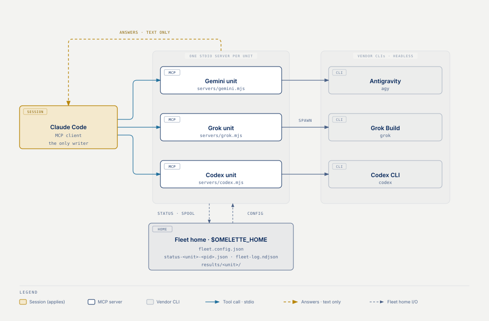

<p align="center">
  
</p>

<h1 align="center">Omelette Fleet</h1>

<p align="center">Gemini, Grok and Codex as read-only units in Claude Code</p>

<p align="center">
  <a href="https://github.com/adxd-og/omelette-fleet/actions/workflows/test.yml"></a>
  <a href="LICENSE"></a>
  
  
</p>

| Question | Where |
|---|---|
| What do I actually get, and is it really read-only? | [What you get](#what-you-get) |
| How do the session, the units and the vendor CLIs connect? | [How it fits together](#how-it-fits-together) |
| What do I need installed before I start? | [Requirements](#requirements) |
| How do I install this and wire it into a project? | [Quickstart](#quickstart) |
| What does `doctor` check, and when does it exit 1? | [What doctor tells you](#what-doctor-tells-you) |
| How do I stop approving every unit call by hand? | [Fewer permission prompts](#fewer-permission-prompts) |
| What CLI subcommands does `omelette-fleet` have? | [CLI](#cli) |
| How do I update omelette-fleet itself? | [Keeping it up to date](#keeping-it-up-to-date) |
| Which vendor does what, and what shouldn't I trust it with? | [Units](#units) |
| Where does config live and what does it look like? | [Configuration](#configuration) |
| How is read-only actually enforced? | [Security](#security) |
| How do I see what a unit is doing right now? | [Status feed](#status-feed) |
| How do the rules reach my session? | [Orchestration](#orchestration) |
| Why CLIs instead of API keys, and other common questions? | [FAQ](#faq) |

## Documentation

Read in this order the first time: ORCHESTRATION, CONFIG, SECURITY, STATUS-FEED, ARCHITECTURE, ADAPTERS, MEASUREMENTS — each opens with its own map of questions.

| If you want to know… | Read |
|---|---|
| Who decides, who proposes, and which unit gets which task | [docs/ORCHESTRATION.md](docs/ORCHESTRATION.md) |
| How the rules, the sub-agents and the guard reach my session | [ORCHESTRATION, How the rules reach a session](docs/ORCHESTRATION.md#how-the-rules-reach-a-session) |
| Which model or effort a task wants | [ORCHESTRATION, Model and effort escalation](docs/ORCHESTRATION.md#model-and-effort-escalation) |
| Which model and effort each shipped sub-agent runs on, and why | [ORCHESTRATION, Effort by role and model](docs/ORCHESTRATION.md#effort-by-role-and-model) |
| How to keep a plan across a compaction | [ORCHESTRATION, Ledger and handoff](docs/ORCHESTRATION.md#ledger-and-handoff) |
| Which config keys exist, what they default to, and how they resolve | [docs/CONFIG.md](docs/CONFIG.md) |
| Which client timeout cut my call short | [CONFIG, Client timeouts](docs/CONFIG.md#client-timeouts) |
| Where the answer of a call that timed out went | [CONFIG, What the result spool keeps](docs/CONFIG.md#what-the-result-spool-keeps) |
| What the handoff hooks do to my ledger | [CONFIG, The handoff hooks](docs/CONFIG.md#the-handoff-hooks) |
| How strong each unit's read-only enforcement actually is | [docs/SECURITY.md](docs/SECURITY.md) |
| What the guard hook blocks | [SECURITY, The guard hook](docs/SECURITY.md#the-guard-hook) |
| Letting Gemini read local files | [SECURITY, Recommended agy allow-rules](docs/SECURITY.md#recommended-agy-allow-rules) |
| What the fleet sends over the network | [SECURITY, Network](docs/SECURITY.md#network) |
| What the fleet writes to disk | [SECURITY, What the fleet writes down locally](docs/SECURITY.md#what-the-fleet-writes-down-locally) |
| What the status feed looks like and how to read it | [docs/STATUS-FEED.md](docs/STATUS-FEED.md) |
| Whether a call finished, came back partial, was cancelled or failed | [STATUS-FEED, What ok, error and cancelled mean](docs/STATUS-FEED.md#what-ok-error-and-cancelled-mean) |
| How to see the fleet at work in a pane, and what the pane reads | [docs/MODS.md](docs/MODS.md) |
| How the pieces fit and what one call goes through | [docs/ARCHITECTURE.md](docs/ARCHITECTURE.md) |
| How to add a fourth unit | [docs/ADAPTERS.md](docs/ADAPTERS.md) |
| What has been measured — planning cost, review yield, `check` before and after — and what has not | [docs/MEASUREMENTS.md](docs/MEASUREMENTS.md) |
| What changed release to release | [CHANGELOG.md](CHANGELOG.md) |

## What you get

Three peers inside Claude Code, each on a subscription you already pay for, none of them able to write while `OMELETTE_ALLOW_WRITE` stays closed (the default). `doctor` is where you find out whether that is actually true on your machine:

```console
$ omelette-fleet doctor      # example output — all three units; config tables trimmed
FLEET DOCTOR · omelette-fleet 1.6.0 · node v20.19.5 · darwin
version       1.6.0 · latest 1.6.0
fleet home    ~/.omelette
fleet config  ~/.omelette/fleet.config.json
claude CLI    ~/.local/bin/claude
claude config ~/.claude.json
rules         project: v1.6.0 · global: absent
agents        project: v1.6.0 (4) · global: absent
skills        project: v1.6.0 (1) · global: absent
hooks         project: v1.6.0 (wired: PreToolUse, PreCompact, SessionStart) · global: absent
handoff       stamp and print on · ledgers: 1
contract      short (rules installed here)
merge policy  session (rules rendered)
mcp timeout   wall-clock: MCP_TOOL_TIMEOUT unset (default ~28 h) ≥ 1800000 needed · ok
              deep research: gemini_deep_research worst case: 3 stages × 2 attempts × (300 + 60 s) = 2160 s · within the wall-clock limit
              idle: CLAUDE_CODE_MCP_TOOL_IDLE_TIMEOUT unset → 30 min default; grok.timeoutS=1800 s reaches it — units send progress every 30 s when the client passes a progress token; otherwise set CLAUDE_CODE_MCP_TOOL_IDLE_TIMEOUT=0 or a per-server "timeout"

── gemini (Gemini) ────────────────────────────────────────────
  bin         agy → ~/.local/bin/agy   [AGY_BIN=(unset)]
  version     1.2.11
  login       OK — agy models listed 14 line(s)
  config      closed — OMELETTE_ALLOW_WRITE does not list "gemini" · effective mode: read-only
              KEY        VALUE                    SOURCE
              enabled    true                     file
              mode       read-only                file
              model      Gemini 3.8 Flash (High)  file
              timeoutS   300                      file
  mcp         omelette-gemini registered (user) → node ~/omelette-fleet/servers/gemini.mjs [file exists]
  status feed ~/.omelette is writable
  results     ~/.omelette/results/gemini · keep 50 · max 50 MB

── grok (Grok) ────────────────────────────────────────────────
  bin         grok → ~/.grok/bin/grok   [GROK_BIN=(unset)]
  version     grok 1.0.41 (4220f3b224a6) [stable]
  login       OK — grok models listed 7 line(s)
  models      CLI default grok-4.7 — in the catalog
  config      closed — OMELETTE_ALLOW_WRITE does not list "grok" · and this unit refuses workspace-write anyway · effective mode: read-only
  mcp         omelette-grok registered (user) → node ~/omelette-fleet/servers/grok.mjs [file exists]

── codex (Codex) ──────────────────────────────────────────────
  bin         codex → ~/.local/bin/codex   [CODEX_BIN=(unset)]
  version     codex-cli 0.159.2
  login       OK — Logged in using ChatGPT
  models      CLI default gpt-6.1-sol — in the catalog; the fleet pins gpt-6.1-sol (catalog head)
  config      closed — OMELETTE_ALLOW_WRITE does not list "codex" · effective mode: read-only
  mcp         omelette-codex registered (user) → node ~/omelette-fleet/servers/codex.mjs [file exists]

No faults in units that are both enabled and registered.
```

## How it fits together



Plug Google Gemini, xAI Grok and OpenAI Codex into Claude Code as MCP **units** — read-only research and code-review peers. Each unit is its own stdio MCP server that spawns the vendor's own CLI headless (`agy`, `grok`, `codex`), so every call rides the subscription you already pay for. The child environment is built from a small allowlist rather than inherited, and API keys that would silently switch a CLI to metered billing are scrubbed on top of it. Claude Code stays the manager: **units propose, the manager applies.** A single config file with a two-key write ceiling keeps a unit from becoming a foot-gun, and a status feed reports what each unit is doing right now.

Zero runtime dependencies. Node core only, no build step.

## Requirements

- **Node ≥ 20**
- **Claude Code** (the MCP client that will host the units)
- **Any subset** of the vendor CLIs, installed and logged in: `agy` (Antigravity, for Gemini), `grok` (Grok Build), `codex` (Codex CLI).
- **macOS or Linux.** Native Windows is not supported yet — the package runs on Windows through WSL; a native harness (`.cmd` shims for the vendor CLIs, path and file-mode differences) is planned after 1.0. CI does not run on Windows.

A partial fleet is normal and expected. `install` skips units whose CLI is not on `PATH`; the units you do have work exactly the same.

## Quickstart

Install the units once, from the clone:

```bash
git clone https://github.com/adxd-og/omelette-fleet.git
cd omelette-fleet
./bin/omelette-fleet.mjs install
```

Then give one project the operating rules — **from inside that project**, because every file this writes lands in the current directory:

```bash
cd /path/to/your/project
/path/to/omelette-fleet/bin/omelette-fleet.mjs rules --agents --hooks
```

(`install --rules` does both halves in one run, and its second half targets the current directory too — so run *that* from the project, not from the clone.)

Then: **restart Claude Code**, **merge the printed snippet** into that same project's `.claude/settings.json`, and run **`omelette-fleet doctor`** there — it names the one thing still missing, if there is one.

`install` registers one MCP server per available unit with `claude mcp add -s user`, named `<prefix>-<unit>` (default prefix `omelette`, so `omelette-gemini`, `omelette-grok`, `omelette-codex`), and creates `~/.omelette/fleet.config.json` from `examples/fleet.config.json` if you don't have one. The tools appear after the restart as `mcp__<prefix>-<unit>__<tool>` — for example `mcp__omelette-codex__codex_code_review`.

`--rules` adds the second half in the current directory: it is exactly `rules --agents --hooks`, so you get the operating rules, the four sub-agent definitions, the `/omelette-test` skill, the guard script and the settings snippet to paste. `install --rules --dry-run` prints both halves and changes nothing. Leave it off and the same files are one command away:

```bash
./bin/omelette-fleet.mjs rules          # <project>/.claude/rules/omelette-fleet.md
./bin/omelette-fleet.mjs rules --global # ~/.claude/rules instead
./bin/omelette-fleet.mjs rules --agents # + the coder / medium coder / tester / reviewer sub-agent definitions and the /omelette-test skill
```

Rules load on the next session start; agent definitions and skills are picked up by Claude Code's watcher — usually within seconds, sometimes minutes (restart if `.claude/agents` or `.claude/skills` did not exist before).

Installing the rules also makes the units cheaper to have around: with the rules installed, each unit sends one line at `initialize` instead of the ~300-token fleet contract. What that line says, how `doctor` reports it and how to force the full contract: [CONFIG, "The contract, and why auto is the default"](docs/CONFIG.md#the-contract-and-why-auto-is-the-default).

Optionally, install the guard hook — the "never commits" rule of the four guarded roles (`omelette-coder`, `omelette-coder-medium`, `omelette-tester`, `omelette-reviewer`), enforced rather than requested, plus a stamp in every plan ledger on each compaction and the last handoff block printed back into the session that follows one ([SECURITY, "The guard hook"](docs/SECURITY.md#the-guard-hook)):

```bash
./bin/omelette-fleet.mjs rules --hooks  # writes .claude/hooks/omelette-guard.mjs
```

**Merge the snippet.** It prints a settings snippet wiring three events — `PreToolUse`, `PreCompact` and `SessionStart` — and you merge it in yourself, into `.claude/settings.json` or `.claude/settings.local.json`: a hook script does nothing until your settings call it, and omelette-fleet reads those files but never writes them. The snippet is a whole `hooks` object, so — as the printed line says — *"Merge this into your settings file (it is a whole `hooks` object — add the events it lists to an existing `hooks` block rather than replacing the file)"*. How the script path in it is quoted per platform: [ORCHESTRATION, "Layer 3: the guard"](docs/ORCHESTRATION.md#layer-3-the-guard).

**Check it.** `doctor` reads both settings files and reports `hooks         project: v1.6.0 (wired: PreToolUse, PreCompact, SessionStart)` — or `NOT wired` with the reason; every line it can print there, and how a matcher is read: [ORCHESTRATION, "What doctor says about the wiring"](docs/ORCHESTRATION.md#what-doctor-says-about-the-wiring).

Optionally, see the fleet at work: `./bin/omelette-fleet.mjs rules --mods` prints how to install the fleet pane, a Claude Code mod that draws the orchestrator, its sub-agents and the three units and who is calling whom, and only reads ([docs/MODS.md](docs/MODS.md)).

Then check the install:

```bash
./bin/omelette-fleet.mjs doctor
```

Once published, the same commands work as `npx omelette-fleet …`.

### What doctor tells you

`doctor` reports the binaries and versions it found, login state, the resolved config with sources, the effective mode and write ceiling per unit, MCP registration, and whether the status-feed directory is writable. Above the units it reports the managed files. It reads Claude Code's `.claude.json` from `$CLAUDE_CONFIG_DIR` first and `~/` second, and prints which file it used — "not registered" against the wrong file would be a lie. It reads the project's `.mcp.json` too, and names it when it is there.

A registration counts as ours by **where it points**, not by what it is called: command `node`, args path exactly this clone's `servers/<unit>.mjs`. So if you registered the units under your own prefix, `doctor` finds them, says `prefix        orion (found on the registrations)` and reports the rest under that name instead of announcing that `omelette-*` is missing. Two different prefixes are ambiguous — it names both, keeps `omelette`, and leaves the choice to `--prefix`. A project-scope entry counts only for the project you are standing in.

| `doctor` line | What it reports | Fault? |
|---|---|---|
| `version` | The fleet's own version, and the latest release (`version … · latest …`) | No: an unreachable GitHub is never a finding |
| `rules`, `agents`, `skills`, `hooks` | Each managed kind at both scopes, with its marker version; `hooks` also says whether the guard is wired ([every NOT-wired reason](docs/ORCHESTRATION.md#what-doctor-says-about-the-wiring)) | No: a missing file is never counted |
| `handoff` | What the installed guard will do, read back out of the script itself: `stamp and print on · ledgers: 1`; `off (handoff.enabled=false)` when the switch is off; `ledgers: none (hook silent — start .omelette/ledger-<plan>.md)` when the project keeps no ledger, which is the state in which the guard deliberately stamps and prints nothing | No |
| `contract` | Which contract the unit servers send this project — `short (rules installed here)`, or the full one ([CONFIG](docs/CONFIG.md#the-contract-and-why-auto-is-the-default)) | No |
| `merge policy` | The configured policy, and whether the rendered rules file carries its sentence yet ([CONFIG](docs/CONFIG.md#workflow-settings)) | No: its PR-gated hint is a hint |
| `mcp timeout` | The client's own two timeout walls — the wall-clock `MCP_TOOL_TIMEOUT` against the longest call the enabled units can make, and the 30-minute stdio idle abort — with the snippet to merge when the first one is short ([CONFIG](docs/CONFIG.md#client-timeouts)) | No: informational |
| `next` | The one thing still missing, from the ladder below | No |
| `bin`, `version` (per unit) | The vendor binary it found, and its `--version`; a non-zero `--version` is `unknown (exit N)` with the tail of its output, never a version | Yes, when the binary is missing |
| `login` | The CLI's login state; a `login status` with no explicit signal is `unknown (exit N)` with the tail of its output, never "signed out" | Yes, when the CLI says it is signed out; `unknown` is not |
| `models` (grok, codex) | The CLI's own default model beside the catalog | No |
| `config` | The resolved config with sources, the effective mode and the write ceiling | No |
| `mcp` | The registration and whether its server file exists; a server of ours by name that points at another clone is "registered elsewhere" | Yes, when the registration points at a server file that no longer exists |
| `status feed`, `results` | Whether the status-feed directory is writable; the result spool's directory and bounds | No |
| `sandbox` (`--probe-sandbox` only) | The probe's verdict: `held`, `BREACHED` or `skipped` with its reason ([SECURITY](docs/SECURITY.md#the-sandbox-probe)) | Yes, for `BREACHED` |

While something is missing it also prints ONE `next` line, in the order a first run needs them:

```
next          omelette-fleet install                     # nothing registered yet (--prefix <p> when you use one)
next          omelette-fleet rules --agents --hooks       # registered, but one of the four managed kinds is missing
next          a managed file has no omelette-fleet marker (see the rules/agents/skills/hooks lines) — inspect it, then `omelette-fleet rules --agents --hooks --force` replaces it
next          <path> is a symlink — omelette-fleet refuses to manage it; remove the link, then rules --agents --hooks
next          merge the hooks snippet into .claude/settings.json (rules --hooks prints it)
next          raise MCP_TOOL_TIMEOUT to 1800000 ms — merge {"env":{"MCP_TOOL_TIMEOUT":"1800000"}} into your settings file (omelette-fleet never writes it)
```

and nothing at all once they are done. The marker line and the symlink line are the exceptions to "run this command": a file at one of those paths that is not ours would be refused by the plain command, and a symlink is refused by `--force` as well — `rules` never writes through one — so `doctor` names the situation instead of sending you into a refusal. It is a hint, never a fault: it does not change the exit code. It looks at the **project** scope only — the scope the commands it suggests write — so a guard installed and wired globally still gets the merge hint here. The timeout line (since 0.3.3) is last on purpose: it is tuning for a machine that already works, so it waits until every first-run step is done.

It exits 1 only for a unit that is **enabled and registered** *and* broken: the vendor binary is missing, the CLI says it is signed out, or the registration points at a server file that no longer exists — and, under `--probe-sandbox`, for the sandbox verdict above. A unit you deliberately never wired up is not a fault — and neither is a login state of `unknown`.

`--probe-sandbox` is the one flag that spends a vendor call per unit, and it is how you find out whether "read-only" is true on your machine rather than on paper:

```
  sandbox     held (12 s, replied "refused")
```

What the probe does step by step, every verdict it can print, and what it does and does not prove: [SECURITY, "The sandbox probe"](docs/SECURITY.md#the-sandbox-probe).

### Fewer permission prompts

Every unit tool is read-only by design — each vendor CLI runs under that vendor's own read-only enforcement (a kernel sandbox for Codex, a permission policy for Gemini; [SECURITY](docs/SECURITY.md#threat-model) says which is which) under the default read-only mode (`OMELETTE_ALLOW_WRITE` closed; [SECURITY, "The ceiling"](docs/SECURITY.md#the-ceiling)) — so approving each call one at a time buys you nothing. Allowlist them once in `.claude/settings.json` (project) or `~/.claude/settings.json` (global):

```json
{
  "permissions": {
    "allow": [
      "mcp__omelette-gemini__*",
      "mcp__omelette-grok__*",
      "mcp__omelette-codex__*"
    ]
  }
}
```

Use your own `--prefix` if you installed with one. If you register the servers per project through a checked-in `.mcp.json` instead of `claude mcp add -s user`, `"enableAllProjectMcpServers": true` in `.claude/settings.json` approves the servers themselves; the `permissions.allow` entries above still decide the per-tool prompting. As everywhere else here, this is a file you edit — `omelette-fleet` never writes `settings.json` or `settings.local.json`.

### CLI

| Command | What it does | Details |
|---|---|---|
| `install [--prefix <name>] [--units <a,b,c>] [--rules] [--dry-run] [--force]` | Registers one MCP server per unit as `<prefix>-<unit>` with `claude mcp add -s user`, and creates `<home>/fleet.config.json` from the shipped example if it does not exist yet (an existing file is never overwritten). A unit whose vendor CLI is not in `PATH` is skipped unless `--force`. `--rules` then runs `rules --agents --hooks` in the current directory and prints the settings snippet, so the whole first run is one command; it happens even when `claude` is missing, since the project files do not depend on it. `--dry-run` prints every command and every write — both halves — and runs nothing. Exits 1 if a `claude mcp add` fails, or if a managed file is refused | [Quickstart](#quickstart) |
| `uninstall [--prefix <name>] [--units <a,b,c>] [--dry-run]` | `claude mcp remove -s user` for those servers. Removing one that was never registered is a no-op; a removal that **fails for one that is registered** prints "Still registered" and exits 1. The fleet config and the status files are never touched | — |
| `update [--check]` | Reports the latest released version, then brings **this** install up to date. A git checkout is fast-forwarded (`git pull --ff-only`); a dirty tree or a diverged branch is refused, never overwritten. An npm install is left alone and the exact `npm i -g` line is printed. MCP registrations are never rewritten — they hold absolute paths a pull does not move. `--check` fetches but pulls nothing and exits 3 when an update is available, 0 when there is none | [Keeping it up to date](#keeping-it-up-to-date) |
| `rules [--global] [--agents] [--hooks] [--mods] [--print] [--remove] [--force] [--dry-run]` | Writes the fleet's operating rules — units propose and this session applies, the ledger and handoff rule, the tester flow, the routing table — to `<cwd>/.claude/rules/omelette-fleet.md`, which Claude Code loads like CLAUDE.md. `--global` writes it under `$CLAUDE_CONFIG_DIR` or `~/.claude` instead. `--agents` also writes four sub-agent definitions (`omelette-coder`: Opus 5.5 xhigh; `omelette-coder-medium`: Opus 5.5 medium; `omelette-tester`: Sonnet 5.5 high; `omelette-reviewer`: Opus 5.5 xhigh; each model pinned by exact id; all four `disallowedTools: Agent`, the reviewer also `Edit, NotebookEdit`) into `.claude/agents` — a definition is where a sub-agent's effort is set — and the `/omelette-test` skill into `.claude/skills`. `--hooks` writes the guard script into `.claude/hooks` and prints the settings snippet that calls it. `--mods` prints how to install the fleet pane mod and writes nothing. `--force` replaces a file that lacks the version marker; `--remove` deletes only files that carry it; `--print` sends the text to stdout; `--dry-run` prints every path and action and writes nothing | [ORCHESTRATION, Layer 2](docs/ORCHESTRATION.md#layer-2-the-rules-file-and-its-marker) |
| `doctor [--prefix <name>] [--probe-models] [--probe-sandbox]` | Checks the install: per unit the binary, `--version`, login state, resolved config with sources, ceiling, MCP registration and status-feed writability; above them the managed files at both scopes, the client's two timeout walls and — while anything is missing — one `next` line, which is a hint and never a fault. `--probe-models` spends real Codex calls to test every catalog id; `--probe-sandbox` spends one real call per unit to test its read-only sandbox. Exits 1 only for a unit that is enabled, registered and broken, or one the sandbox probe caught writing | [What doctor tells you](#what-doctor-tells-you) |
| `show [<unit> \| fleet \| agents \| handoff \| workflow]` | Every config key for one unit or all of them: value, where it came from, and the ceiling. `show fleet` prints the top-level keys (`contract`, `updateCheck`); `show agents` prints the `agents` block that `rules --agents` renders the sub-agent definitions from; `show handoff` prints the auto-handoff block that `rules --hooks` renders into the guard; `show workflow` prints the merge policy that `rules` renders into the rules file | [docs/CONFIG.md](docs/CONFIG.md) |
| `set <key>=<value> \| <unit>.<key>=<value> \| agents.<agent>.<key>=<value> \| handoff.<key>=<value> \| workflow.<key>=<value> [...]` | Changes keys in the config file: a bare `<key>=<value>` is a top-level fleet key (`contract`, `updateCheck`), and the dotted forms edit a unit, an agent, the handoff block or the workflow block. Unknown units, unknown agents, unknown keys and invalid values are refused; the rest of the file is kept | [CONFIG, Editing with set](docs/CONFIG.md#editing-with-set) |
| `call <unit> <tool> [json-args] [--timeout <seconds>]` | Drives a unit's server over real stdio (initialize → tools/list → tools/call). `json-args` must be a JSON **object**. Exit 0 = ok, 2 = the tool answered with an error, 1 = usage error or the call never completed. Default timeout 900 s, clamped to 1–86400 | Below the table |
| `results [<unit>] [<id>] [--path] [--stats [--since <when>]]` | Prints what the units spooled — every tool call's answer, written to `<home>/results/<unit>/<id>.md` before the response is sent: no arguments, the last 10 across the fleet, newest first; a unit, its last 10; a unit and an id, that result, header and text; `--path` prints the path instead, and `--stats` what the spool cost, narrowed by `--since`. Reads files only — no server, no vendor CLI, nothing spent. Exit 1 for an unknown unit, an id that is not in the spool, a `--since` that is neither a window nor a date, `--since` without `--stats`, `--stats` with an id, or `--stats --path` | [CONFIG, What the result spool keeps](docs/CONFIG.md#what-the-result-spool-keeps) |
| `check <file.md> [--strict] [--require <n>] [--root <dir>]` | Verifies the pointer lines of a sub-agent report or a scout map — `path:line` (relative to the root) · a verbatim fragment in backticks · the claim. Read-only. Exit `0` when every pointer is `ok` — `stale` too, unless `--strict` — and there is at least one distinct pointer (`--require 0` for a report whose findings say `none`); `1` otherwise; `2` for a usage error | [ORCHESTRATION, Evidence with pointers](docs/ORCHESTRATION.md#evidence-with-pointers) |
| `--help`, `--version` | Every subcommand answers `--help` / `-h` too, and so does `help <command>` | — |

If `claude` is not in `PATH`, `install` still writes the fleet config and prints the exact `claude mcp add` commands to run later; `uninstall` prints its commands and changes nothing. Neither the CLI nor the servers ever shell out — every child is `spawn(bin, [args])`, so a path or a value containing a space is data, not shell syntax. The only files the CLI writes are `<home>/fleet.config.json`, `<home>/update-check.json` and — only when you run `rules` — the marked files it manages under `.claude/rules/`, `.claude/agents/`, `.claude/skills/` and `.claude/hooks/`, never one that lacks its marker unless you pass `--force`. The unit servers write two more of their own: the status feed and `<home>/results/<unit>/*.md`, the result spool. Claude Code's own config is parsed, never written: that goes for `.claude.json` and for `settings.json` / `settings.local.json`, which `doctor` reads to say whether the guard hook is wired and `rules --hooks` only ever prints a snippet for.

`call` is the way to test a unit without a client: `./bin/omelette-fleet.mjs call codex codex_models '{}'`. It distinguishes the two failures that matter — a tool that answered with an error (exit 2, the unit talking) from a server that errored at the protocol level or died mid-call (exit 1, the pipe breaking), rather than reporting either as an empty success.

### Keeping it up to date

```bash
./bin/omelette-fleet.mjs update          # fast-forward this checkout
./bin/omelette-fleet.mjs update --check  # report only; exit 3 = an update is available
```

Restart Claude Code afterwards. The unit servers are spawned per session and there is no daemon, so a running session keeps the code it started with until you restart it.

You do not have to remember to check: each unit server makes one unauthenticated request to the GitHub releases API at startup and prints a single stderr line — `update: omelette-fleet X.Y.Z is available (you run …)` — when there is something newer. The check runs at most **once every 24 hours** (the answer is cached in `<home>/update-check.json`), is capped at **2.5 s**, is fire-and-forget so it can never delay a tool call, and stays quiet when you are current. Switch it off with `OMELETTE_UPDATE_CHECK=0` in the server's env block, or `"updateCheck": false` in the fleet config.

The vendor CLIs update *themselves*; this package deliberately does not. `doctor` shows both — each unit's `version` line, and the fleet's own `version … · latest …` header.

## Units

| Unit | CLI | Log in with | Tools | Good for | Do not trust it with |
|---|---|---|---|---|---|
| **gemini** | `agy` (Antigravity) | agy has no `login` subcommand — sign in through the OAuth flow on your first interactive `agy` run; credentials land under `~/.gemini/` | `gemini_research`, `gemini_deep_research`, `gemini_image`, `gemini_models` | Grounded web research and fact synthesis; multi-source deep research; reading local files **including images and PDFs** (give an absolute path — needs `read_file(*)` in the agy allow-rules, the opt-in set in [SECURITY](docs/SECURITY.md#recommended-agy-allow-rules)); inputs past 1M tokens and formal/scientific reasoning via `Gemini 3.1 Pro (High)`; a non-Google second opinion via `GPT-OSS 120B (Medium)`; image generation | Writing anything. agy has no kernel sandbox — read-only here rests on your own agy `settings.json` permission policy plus a prompt preamble, the weakest posture in the fleet. Deep-research sources are **asserted by the model**; verify them. Anything it read off the web is untrusted input |
| **grok** | `grok` (Grok Build) | `grok login`, or `grok login --device-code` | `grok_research`, `grok_code_review`, `grok_image`, `grok_image_edit`, `grok_models` | A cheap, fast second opinion; mechanical code analysis; math/STEM checks (AIME 93–100%, GPQA Diamond 84.6–88%); high-volume research sweeps; image generation **and image-to-image editing** — the only unit in the fleet that edits images. Research and review runs stream their output, so a hard-killed run comes back with the text it had produced, and token usage now reaches the status feed | Fact-critical claims: roughly one factual answer in three is wrong, and it is overconfident — the measurements: [ORCHESTRATION, "Never a sole source"](docs/ORCHESTRATION.md#never-a-sole-source). Never the sole source of a fact. Also: architecture calls, long-horizon engineering (DeepSWE v1.1 71.0% at high on xAI's own 4.7 table, behind GPT-5.6 Sol Max's 72.7%), UI/front-end taste. Prompt-injection susceptible; `workspace-write` is **declared unsupported** and refused even with the ceiling open |
| **codex** | `codex` (Codex CLI) | `codex login` (ChatGPT account) | `codex_research`, `codex_code_review`, `codex_image`, `codex_models` | The strongest code review in the fleet and agentic terminal analysis, on `gpt-6.1-sol` (xhigh) by default — AA Intelligence Index 52 against astra's 53 at max effort, at $0.72 per Index task against $3.26 (AA, read 2026-09-30) — with `gpt-6-astra` for heavy reviews only (the pre-release security audit, root-cause hunts); directory-scoped review with an explicit `cwd`; grounded research with web search; image generation via the CLI's built-in **gpt-image-2** tool, saved to a temp directory outside every project; reports the fullest token usage in the fleet (input, cached, output, reasoning) | Being a source of record — verify factual claims. `gpt-6-luna` on anything multi-file, long inputs or prohibition-heavy briefs (limits inherited from gpt-5.6-luna until measured). `effort: max` or `ultra` on routine work |

Model ids, benchmark numbers and routing advice live in `units/<unit>/models.js` and are served by each unit's `<unit>_models` tool — call it when you are unsure which model a task belongs on.

## Configuration

One JSON file, `~/.omelette/fleet.config.json` (or `$OMELETTE_HOME/fleet.config.json`), read fresh on every call; `install` creates it from `examples/fleet.config.json`, which carries only what an operator decides — which units run, their mode, timeouts and web search, the status feed, and Gemini's model, which has no built-in default — so every key it omits follows the package's defaults, release by release:

```json
{
  "version": 1,
  "defaults": {
    "status": true
  },
  "units": {
    "gemini": {
      "enabled": true,
      "mode": "read-only",
      "model": "Gemini 3.8 Flash (High)",
      "timeoutS": 300
    },
    "grok": {
      "enabled": true,
      "mode": "read-only",
      "timeoutS": 1800,
      "maxTurns": 30
    },
    "codex": {
      "enabled": true,
      "mode": "read-only",
      "webSearch": true,
      "timeoutS": 600
    }
  }
}
```

One consequence worth knowing: because the Codex unit runs with `--ignore-user-config`, leaving `codex.model` unset does **not** fall back to your `~/.codex/config.toml` default — the adapter pins the first catalog entry (`gpt-6.1-sol`) instead and logs that it did. The sample sets neither `codex.model` nor `codex.effort` on purpose: the catalog head runs, each model at its catalog pairing (`gpt-6.1-sol` at `xhigh`, `gpt-6-luna` at `medium`), and a `codex.effort` would force that one effort on every model.

Every key, its default, the resolution order, and the per-unit environment overrides: **[docs/CONFIG.md](docs/CONFIG.md)**.

## Security

- Units are read-only by default; the mutating path stays in Claude Code, under your approval.
- Write mode needs **two keys**: `mode: "workspace-write"` in the config file *and* the unit listed in `OMELETTE_ALLOW_WRITE` in the MCP server's env block. The config can only narrow, never widen.
- Enforcement strength differs by vendor: Codex is an OS-level kernel sandbox (plus `--ignore-user-config --ignore-rules`, so your `~/.codex/config.toml` — MCP servers, plugins, the notify command — never reaches a fleet run; `~/.codex/hooks.json` still does, see SECURITY), Grok is a spawn-arg tool allowlist (and refuses write mode outright), Gemini is the CLI's own permission policy — the weakest of the three.
- The child environment is **built from an allowlist**, not inherited: a review run cannot read your `GH_TOKEN` or cloud credentials. Billing-risk API keys are scrubbed on top of that, and `--dangerously-*` / `--always-approve` flags are never passed.
- Everything a unit reads from the web or from a repository is untrusted input.

Threat model, the per-unit enforcement matrix, and what is only best-effort: **[docs/SECURITY.md](docs/SECURITY.md)**.

## Status feed

Every unit writes what it is doing to `$OMELETTE_HOME` (default `~/.omelette`): a per-process snapshot `status-<unit>-<pid>.json` with the calls running right now and the last finished event, and a shared append-only `fleet-log.ndjson` with one compact JSON line per start and end. Writes are atomic, mode 0600, fail-soft (an fs error can never break a tool call), and the log self-trims. Any menu-bar app, HUD or `tail -f` can read it. One reader of this feed is [Omelette usage-checker](https://github.com/adxd-og/usage-checker), a macOS menu-bar app; the feed is an open contract, so nothing here depends on it. Schema and field lists: **[docs/STATUS-FEED.md](docs/STATUS-FEED.md)**. An `end` event's `resultId` names the file the answer itself was spooled to; `omelette-fleet results` prints that spool from a shell, and `<unit>_result` hands the answer back inside a session.

## Orchestration

How to actually run a session with a fleet — who decides, who proposes, which unit gets which task, and when to escalate a model or effort level: **[docs/ORCHESTRATION.md](docs/ORCHESTRATION.md)**. The adapter contract and internals: **[docs/ARCHITECTURE.md](docs/ARCHITECTURE.md)**. Adding a fourth unit: **[docs/ADAPTERS.md](docs/ADAPTERS.md)**.

**Rules in your session.** Three layers put that operating model in front of Claude Code:

| Layer | What it delivers | Command | Takes effect |
|---|---|---|---|
| 1. The contract | The fleet contract from the MCP `initialize` handshake, in context as "MCP Server Instructions" — the one-line short version where a rendered rules file is found (or `contract=short`), and otherwise the full one: units propose, the session applies, absolute paths, verify Grok | None: every unit server sends it | After a restart, with nothing to run |
| 2. Rules, agents and the skill | `<project>/.claude/rules/omelette-fleet.md`, which Claude Code loads like CLAUDE.md; with `--agents`, the coder, medium coder, tester and reviewer sub-agent definitions — where their effort and the tester's turn limit are set, and where the harness is told they may not spawn sub-agents of their own — plus the `/omelette-test` skill, which forks the tester with the diff taken from git at invocation so it can never be handed the coder's summary | `omelette-fleet rules --agents` (`--global` for `~/.claude/rules`) | Rules on the next session start; definitions and the skill through Claude Code's watcher |
| 3. The guard | One guard script that blocks every shipped role's `git commit` at `PreToolUse`, stamps a re-read marker into your plan ledger at `PreCompact`, and prints that ledger's last handoff block back into the session that opens after a compaction at `SessionStart` — no reminder, no held `Stop`, no summary written by the hook | `omelette-fleet rules --hooks`, then a snippet you paste into your own settings file | Once your settings call it |

You invoke the skill as `/omelette-test <spec path> [repo path]` — the repo path is for an orchestrator whose session sits in another repository; leave it off and the diff is the current directory's. Details, including how the version marker decides which files the fleet may overwrite: **[docs/ORCHESTRATION.md](docs/ORCHESTRATION.md#how-the-rules-reach-a-session)**. One sentence of those rules is yours to pick — `omelette-fleet set workflow.merge=pr && omelette-fleet rules` writes the pull-request policy, where the session opens a PR and never merges into main itself — and what `doctor` prints about it: [CONFIG, "Workflow settings"](docs/CONFIG.md#workflow-settings).

## FAQ

**Why CLIs instead of API keys?**
Two reasons. Billing: each vendor CLI authenticates against the subscription you already pay for, and an API key present in the environment would silently flip it to metered API billing — so every key that could do that is deleted from the child process env. Safety: each CLI ships its own sandbox and permission machinery (Codex's OS sandbox, Grok's `--tools` allowlist and permission rules, agy's permission policy), and this package drives those instead of reimplementing them against a raw API.

The flip side is that a CLI run is a program with an environment, so the child env is built from an allowlist rather than inherited — a unit running read-only shell commands would otherwise be able to read every secret in your shell. Details in [docs/SECURITY.md](docs/SECURITY.md).

**Why read-only?**
Because a review peer that can also write is a review peer you have to supervise twice. Units read, search, analyse and propose; Claude Code applies the change, where your normal approval flow already sits. It also contains the blast radius of prompt injection: a unit that ingests a hostile web page or repository can only report back, not act.

**Can I let a unit write?**
Only deliberately, and only where it is actually enforceable. Write mode takes two keys: `mode: "workspace-write"` for that unit in the config file, **and** the unit named in `OMELETTE_ALLOW_WRITE` in the server's env block — which lives outside every project and cannot be edited by a read-only unit. Then the unit itself has to implement the mode:

- **Codex** does. Writes are kernel-scoped to the `cwd` you pass, and the adapter grants it only to `codex_code_review` with an explicit absolute `cwd` — `codex_research` is read-only whatever the config says. (`codex_image` also runs `workspace-write`, and is the one call that does **not** consult the ceiling: the kernel scopes it to a throwaway temp directory the adapter just created, because an image tool that cannot save a file is not a tool. Details in [docs/SECURITY.md](docs/SECURITY.md).)
- **Grok** does not. `workspace-write` is declared unsupported and refused even with the ceiling open.
- **Gemini** maps it to agy's `--mode accept-edits`, which is agy's own permission layer inside the run's cwd — real, but not kernel-enforced, and used only when the call passes a `cwd` (without one, research runs read-only in a fresh empty directory). `ORION_ALLOW_GEMINI_MUTATE=1` is honoured as a legacy alias for opening the ceiling for `gemini` only.

**What if my ChatGPT plan rejects a Codex model?**
The Codex catalog lists what exists in the current generation, not what one account happens to accept. A refused id fails fast, before any work, with `The '<id>' model is not supported when using Codex with a ChatGPT account`.

- On 2026-09-30, on codex-cli 0.159.2, `doctor --probe-models` on the ChatGPT plan these probes run on accepted every id in the catalog (`gpt-6.1-sol` also at `ultra`); the same day, 0.157.1 had refused `gpt-6.1-sol` for lack of its metadata while accepting the other six. `gpt-5.6-sol` had been refused on 2026-09-03 (codex-cli 0.146.0).
- The default `gpt-6.1-sol` needs a codex-cli that carries its metadata, which older ones lack: an older CLI refuses it with that same message, not because of the plan — update Codex. Which versions, probed when: [ORCHESTRATION, "Model and effort escalation"](docs/ORCHESTRATION.md#model-and-effort-escalation).
- `gpt-6-astra-pro`, `gpt-6-pro` and `gpt-6` are rejected on a ChatGPT plan and are not in the catalog ([when last probed](docs/ORCHESTRATION.md#model-and-effort-escalation)).
- `omelette-fleet doctor --probe-models` tells you exactly which ids your account accepts. Plain `doctor` prints your installed CLI's bundled default beside the model the fleet pins — since 0.159.1 the CLI's is `gpt-6.1-sol`, the same catalog head the fleet pins when no `codex.model` is configured, and the fleet pins its model explicitly regardless, because it runs with `--ignore-user-config`.

**How do I add a unit?**
Three files and a test: `units/<unit>/models.js` (the model allowlist and cheat-sheet), `units/<unit>/adapter.mjs` (a `defineUnit({...})` call), `servers/<unit>.mjs` (a two-line entrypoint). The runtime gives you config, the ceiling, catalog validation, the mutate gate, the status feed, bounded spawn with the env allowlist and billing scrub, and JSON-RPC. Step by step, with a skeleton and the fake-binary test pattern: [docs/ADAPTERS.md](docs/ADAPTERS.md).

**Why three servers instead of one?**
Failure isolation and stable names. A missing CLI, a hung vendor process, or an adapter bug takes down one server, not the fleet — the other units keep answering. Each server also owns a fixed tool list, so installing or removing a unit never reshuffles the tools of the others, and you can enable, disable, time-out and configure each vendor independently. It costs one idle Node process per unit.

## License

MIT — see [LICENSE](LICENSE).
